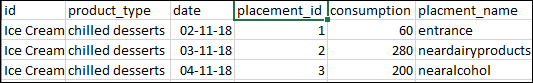
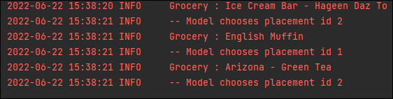

## ALLOCATION OF PLACES TO GROCERIES FOR MAXIMUM SALES

#### PROBLEM STATETMENT:
Given a list of grocery items to be sold, find out the best place to place them inside a supermarket according 
to the demand of the product

#### METHOD

##### Datagathering
Three different grocery products and their demand at different days from 3 years

##### Datapreprocessing
Each product is provided with a placement id and the description of the placement id differe for each of them as below

##### Algorithm
Reinforcement learning is used and UCBvtuned is used to compute the best placement id for the product

##### Techniques involved
Reinforcement learning, data manipulation, report buliding

##### Languages and tools used
Python

#### Limitations
Reinforcement learning is a real time algorithm and hence to decide the placement id  would take time. 

##### Results 
The snippets of the results are shown below

The machine choosing the best placement position for the three different products is 
shown below 

